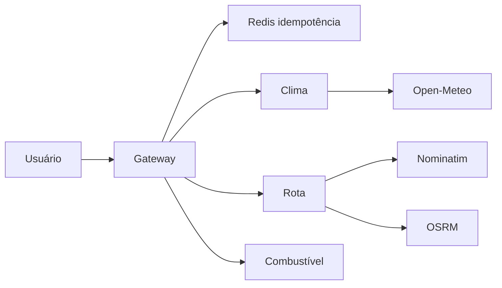
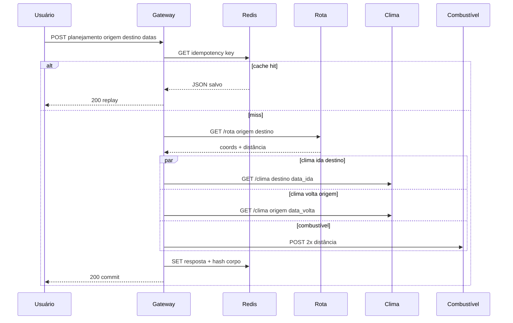

# Modelagem — Planejador de Viagens Inteligentes

## Domínio (origem explícita)

A viagem é definida obrigatoriamente por **origem**, **destino** e **janelas temporais** (ida e volta). A origem não é apenas um ponto geográfico implícito: ela entra no contrato da API (`SolicitacaoPlanejamento.origem`), na resolução de endereços do serviço de rota (`GET /rota?origem=...`) e no agregado de clima na **volta** (previsão na coordenada resolvida da origem).

| Conceito | Descrição |
|----------|-----------|
| Origem | Local de partida informado pelo usuário (texto livre, geocodificado). |
| Destino | Local de chegada na ida; base para clima na data de ida. |
| Rota | Distância e duração estimadas (OSRM) com fallback por Haversine. |
| Combustível | Custo médio a partir da distância **ida + volta** e parâmetros econômicos. |

## Arquitetura lógica (distribuída)

## Sequência do planejamento

## Políticas de resiliência no gateway

| Mecanismo | Onde | Comportamento |
|-----------|------|----------------|
| Timeout | Chamadas HTTP aos microsserviços | Falha rápida; evita filas internas longas. |
| Retry | Transporte/timeout | Até N tentativas com backoff. |
| Fallback | Clima, rota, combustível | Resposta parcial marcada `degradado` ou estimativa simplificada. |
| Idempotência | Redis | Mesma chave + mesmo corpo = mesma resposta; chave + corpo diferente = conflito. |

Esta modelagem amarra o requisito acadêmico de **origem** ao contrato, ao fluxo de dados e ao comportamento degradado quando integrações externas falham.
